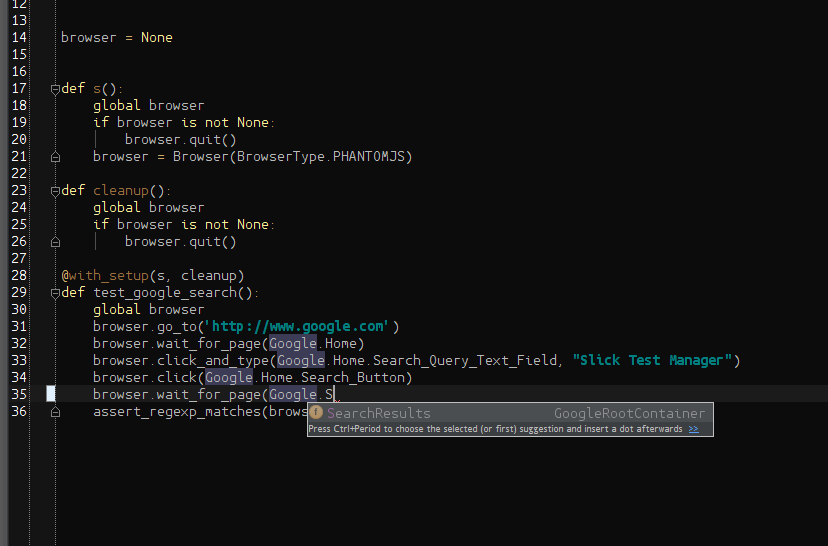

Examples
========

.. toctree::
   :maxdepth: 2

Below you will find various examples.  These examples are explained here (in detail), but the source for them is 
available from `Github <https://github.com/slickqa/slick-webdriver-python/tree/master/examples>`_.

Simple Example
--------------

The following is the simple example, which is a python test (written using 
`nose <https://nose.readthedocs.org/en/latest/>`_).  The test in this example loads the google home page, 
and searches for *Slick Test Manager* and ensures a particular page is in the results::

    from slickwd import BrowserType, Browser, Container, WebElementLocator, Find
    from nose import with_setup
    from nose.tools import assert_regexp_matches
    
    # Page Classes --------------------------------------------------
    class GoogleSearchPage(Container):
        Search_Query_Text_Field = WebElementLocator("Search Box", Find.by_name("q"))
        Search_Button = WebElementLocator("Search Button", Find.by_name("btnG"))
    
        def is_current_page(self, browser):
            return browser.exists(GoogleSearchPage.Search_Query_Text_Field, timeout=0, log=False)
    
    class SearchResultsPage(Container):
        Results_Div = WebElementLocator("Results Div", Find.by_id("ires"))
    
        def is_current_page(self, browser):
            return browser.exists(SearchResultsPage.Results_Div, timeout=0, log=False)
    
    # Tests ---------------------------------------------------------
    browser = None
    
    
    def s():
        global browser
        if browser is not None:
            browser.quit()
        browser = Browser(BrowserType.FIREFOX)
    
    def cleanup():
        global browser
        if browser is not None:
            browser.quit()
            browser = None
    
    @with_setup(s, cleanup)
    def test_google_search():
        global browser
        browser.go_to('http://www.google.com')
        browser.wait_for_page(GoogleSearchPage)
        browser.click_and_type(GoogleSearchPage.Search_Query_Text_Field, "Slick Test Manager")
        browser.click(GoogleSearchPage.Search_Button)
        browser.wait_for_page(SearchResultsPage)
        assert_regexp_matches(browser.get_page_text(), '.*SlickQA:.*')

This may seem like a lot, but normally the :doc:`page-classes` would be in a different module that you would import.
Let's start with the page classes and explain what they are here::

    class GoogleSearchPage(Container):
        Search_Query_Text_Field = WebElementLocator("Search Box", Find.by_name("q"))
        Search_Button = WebElementLocator("Search Button", Find.by_name("btnG"))

        def is_current_page(self, browser):
            return browser.exists(GoogleSearchPage.Search_Query_Text_Field, timeout=0, log=False)

In this page class, there are 2 *locators*.  The locators are the elements that are used in tests.  Page classes
mostly serve as a grouping of WebElementLocators.  The first locator is named *Search Box* and it looks for an element
anywhere on the page with the *name="q"* attribute on it.  In this case it's an input box of type text.  Notice I didn't
have to supply all that info, just the part that uniquely identifies the element so that webdriver can get a hold of it.

The second element is very similar, it's called "Search Button" and it is identified by it's name attribute as well.

The page class is a sub class of :class:`slickwd.Container`.  In terms of this framework that is special because it
allows the page to include a method to *detect* itself.  The *is_current_page* method needs to return a boolean (true
or false) and should execute very quickly.  This method is what allows for the test to call *wait_for_page* on this
page.  We will see that later on in the test.  The only things that may look out of place on the *is_current_page*
method is the last 2 parameters that you don't normally pass in.  These tell the framework to only check for the
element 1 time (*timeout=0* parameter), and not to log it (*log=False* parameter).  The logging is there because
logging each call to is_current_page in this context could be redundant noise in the logs.  By setting *log=False* in
the page class's call to *browser.exists(...)* we make sure that only the tests explicit calls to browser actions
are logged.

I won't cover line by line the second page class as it is almost the same as the first.

The setup and cleanup methods are worth making a few notes about::

    browser = None

    def s():
        global browser
        if browser is not None:
            browser.quit()
        browser = Browser(BrowserType.FIREFOX)

    def cleanup():
        global browser
        if browser is not None:
            browser.quit()
            browser = None

In this part of the example we have first a global variable (or at least module level variable).  This allows us
to use this variable in all the test functions.  I could have used a class instead and made this an instance variable
but I used module level variables (with functions) instead.

Notice how the setup method is named *s()*.  This is because if I had named it setup, nose would have treated it as a
module level setup function, and it would have been called twice on the first test.

Notice how the setup quits the browser if it's running.  To make tests more robust they should be able to handle any
scenario of bad or unworking cleanup.  I should have also put the quit in a try block, but I'll leave that as an
exercise of the reader.

Using a setup and cleanup to start and stop the browser is a good idea mostly because it centralizes the logic of
launching the browser.  In this case the browser is hard coded, but it's actually recommended to make that a
configuration parameter.  You can do that using environment variables or a configuration file.  Once again that is
left to the reader to implement.

Finally the test::

    @with_setup(s, cleanup)
    def test_google_search():
        global browser
        browser.go_to('http://www.google.com')
        browser.wait_for_page(GoogleSearchPage)
        browser.click_and_type(GoogleSearchPage.Search_Query_Text_Field, "Slick Test Manager")
        browser.click(GoogleSearchPage.Search_Button)
        browser.wait_for_page(SearchResultsPage)
        assert_regexp_matches(browser.get_page_text(), '.*SlickQA:.*')

The test is marked with the setup and cleanup functions.  Then notice how there is very little busy work for the test.
This test should be clear.  The only real thing to note is the final line that does the assertion.  A better way would
have been to look at a specific link text, but that would have been more work without a major benefit, and it may have
made the test more fragile.

Finally let's look at the logging output of this test, as that is a feature of the framework::

    slickwd.Browser: DEBUG: New browser instance requested with browser_type='FIREFOX' and remote_url=None
    slickwd.Browser: INFO: Creating a new browser (locally connected) of type firefox
    slickwd.Browser: DEBUG: Navigating to url 'http://www.google.com'.
    slickwd.Browser: DEBUG: Waiting for up to 30.00 seconds for page GoogleSearch to be the current page.
    slickwd.Browser: DEBUG: Found page GoogleSearch after 0.24 seconds.
    slickwd.WebElementLocator: DEBUG: Waiting for up to 30.00 seconds for element Search Box found by name "q" to be available.
    slickwd.WebElementLocator: INFO: Found element Search Box using locator property name "q" after 0.00 seconds.
    slickwd.Browser: DEBUG: Clicking on element Search Box found by name "q"
    slickwd.Browser: DEBUG: Typing "Slick Test Manager" into element Search Box found by name "q"
    slickwd.WebElementLocator: DEBUG: Waiting for up to 30.00 seconds for element Search Button found by name "btnG" to be available.
    slickwd.WebElementLocator: INFO: Found element Search Button using locator property name "btnG" after 0.01 seconds.
    slickwd.Browser: DEBUG: Clicking on element Search Button found by name "btnG"
    slickwd.Browser: DEBUG: Waiting for up to 30.00 seconds for page SearchResults to be the current page.
    slickwd.Browser: DEBUG: Found page SearchResults after 3.60 seconds.
    slickwd.Browser: INFO: Calling quit on browser instance.

Notice how even thought the test doesn't explicitly make any logging requests, we can see what the test did, how it
did it, and how long it took to do it.

Nested Page Class Example
-------------------------

Nested page classes can be nice for code completion (if you are using an editor or IDE with python code completion like
`PyCharm <https://www.jetbrains.com/pycharm/>`_), and it can improve your log output.  Below you'll see an example that
is very much like the above example (it does the same test), but with nested page classes stored in another python
file.  First the page classes (`pages.py <https://github.com/slickqa/slick-webdriver-python/blob/master/examples/nested-page-classes/pages.py>`_)::

    from slickwd import Container, WebElementLocator, Find

    class GoogleRootContainer(Container):
        """
        Root google page.  An instance is supposed to be created called Google.
        """

        def __init__(self, name):
            self.container_name = name
            self.Home = GoogleHomePage()
            self.SearchResults = GoogleSearchResultsPage()

    class GoogleHomePage(Container):
        """
        Google "Home" page, or www.google.com.
        """

        def __init__(self):
            self.Search_Query_Text_Field = WebElementLocator("Search Box", Find.by_name("q"))
            self.Search_Button = WebElementLocator("Search Button", Find.by_name("btnG"))

        def is_current_page(self, browser):
            return browser.exists(self.Search_Query_Text_Field, timeout=0, log=False)

    class GoogleSearchResultsPage(Container):
        """
        A page with google search results.
        """

        def __init__(self):
            self.Results_Div = WebElementLocator("Results Div", Find.by_id("ires"))

        def is_current_page(self, browser):
            return browser.exists(self.Results_Div, timeout=0, log=False)

    Google = GoogleRootContainer("Google")

And the tests (`searchtests.py <https://github.com/slickqa/slick-webdriver-python/blob/master/examples/nested-page-classes/searchtests.py>`_)::

    import sys
    import os

    from slickwd import BrowserType, Browser
    from pages import Google
    from nose import with_setup
    from nose.tools import assert_regexp_matches

    browser = None

    def s():
        global browser
        if browser is not None:
            browser.quit()
        browser = Browser(BrowserType.PHANTOMJS)

    def cleanup():
        global browser
        if browser is not None:
            browser.quit()

    @with_setup(s, cleanup)
    def test_google_search():
        global browser
        browser.go_to('http://www.google.com')
        browser.wait_for_page(Google.Home)
        browser.click_and_type(Google.Home.Search_Query_Text_Field, "Slick Test Manager")
        browser.click(Google.Home.Search_Button)
        browser.wait_for_page(Google.SearchResults)
        assert_regexp_matches(browser.get_page_text(), '.*SlickQA:.*')

As mentioned above there are 2 primary advantages for the nested page classes: first code completion in a python IDE,
and second in the logs.  The logs are improved because every time you do an action such as clicking on an element, you
can see the hierarchy of page classes and what element a page is on.  This doesn't happen with the static layout.

Here is an example of the output you would get from the logs::

    slickwd.Browser: DEBUG: New browser instance requested with browser_type='PHANTOMJS' and remote_url=None
    slickwd.Browser: INFO: Creating a new browser (locally connected) of type phantomjs
    slickwd.Browser: DEBUG: Navigating to url 'http://www.google.com'.
    slickwd.Browser: DEBUG: Waiting for up to 30.00 seconds for page Google.Home to be the current page.
    slickwd.Browser: DEBUG: Found page Google.Home after 0.01 seconds.
    slickwd.WebElementLocator: DEBUG: Waiting for up to 30.00 seconds for element Search Box on page Google.Home found by name "q" to be available.
    slickwd.WebElementLocator: INFO: Found element Search Box using locator property name "q" after 0.01 seconds.
    slickwd.Browser: DEBUG: Clicking on element Search Box on page Google.Home found by name "q"
    slickwd.Browser: DEBUG: Typing "Slick Test Manager" into element Search Box on page Google.Home found by name "q"
    slickwd.WebElementLocator: DEBUG: Waiting for up to 30.00 seconds for element Search Button on page Google.Home found by name "btnG" to be available.
    slickwd.WebElementLocator: INFO: Found element Search Button using locator property name "btnG" after 0.01 seconds.
    slickwd.Browser: DEBUG: Clicking on element Search Button on page Google.Home found by name "btnG"
    slickwd.Browser: DEBUG: Waiting for up to 30.00 seconds for page Google.SearchResults to be the current page.
    slickwd.Browser: DEBUG: Found page Google.SearchResults after 0.01 seconds.
    slickwd.Browser: INFO: Calling quit on browser instance.

Notice each element knows what page it is on in the code, and each page knows it's *parent* in the hierarchy.  This
can help greatly when comparing code and logs, as well as navigating code.

I'm going to go backwards through the code.  First let's look at the test.  The test is almost the same as in the
single page example.  The difference comes in the page and elements.  Notice how each of the page classes starts with
*Google.*.  This is the root page in the page class hierarchy.  The advantage (as was said above) comes when using an
IDE.  Take a look at the following screenshot taken while writing the test:

|code-completion|

This allows the people writing the tests to effectively browse through the hierarchy of available elements, reducing
the possibility of duplication of definitions.

The page classes are a little bit different than explained in the simple example.  Let's go through the differences::

    class GoogleRootContainer(Container):
        """
        Root google page.  An instance is supposed to be created called Google.
        """

        def __init__(self, name):
            self.container_name = name
            self.Home = GoogleHomePage()
            self.SearchResults = GoogleSearchResultsPage()

This page class is entirely new.  In our page class hierarchy this is the root.  It is responsible for creating
instances of all the other nested page classes.  Notice that they are created in the *__init__* instead of statically
on the page.  There is one other thing different about this page class.  It accepts a name parameter.  One of the
advantages of page classes is that each element and page knows it's name as far as the hierarchy is concerned.  But
in order for that to work you have to name the root node.

Something you don't even realize that is happening here is that when the constructor to *GoogleHomePage* is called and
assigned to the *Home* attribute name on the current instance, underneath the *Container* class sets up the parent-child
relationship and sets the known name for the *GoogleHomePage* instance to *Home*.  This is why you only have to set the
name of the root node of your hierarchy.

The other page classes look similar, except the :class:`slickwd.WebElementLocator` instances are now instantiated
inside the page class's *__init__*.

I only show 2 levels of page class here, but you can nest them as deep as you want (mostly).  Recursion is used for
getting the names of pages, but if you hit that limit you will have an extremely deep hierarchy.

The only other line that might look different is::

    Google = GoogleRootContainer("Google")

This line allows for an importable name called Google that is a singleton instance of the class GoogleRootContainer.
This could have been instantiated in a setup, if for instance you needed to pass configuration data to the page class
hierarchy.  One example of needing to do this is if you had different locators for different versions of a product.
You could store that version in the page class hierarchy in order to decide which locator to add to the page class.

