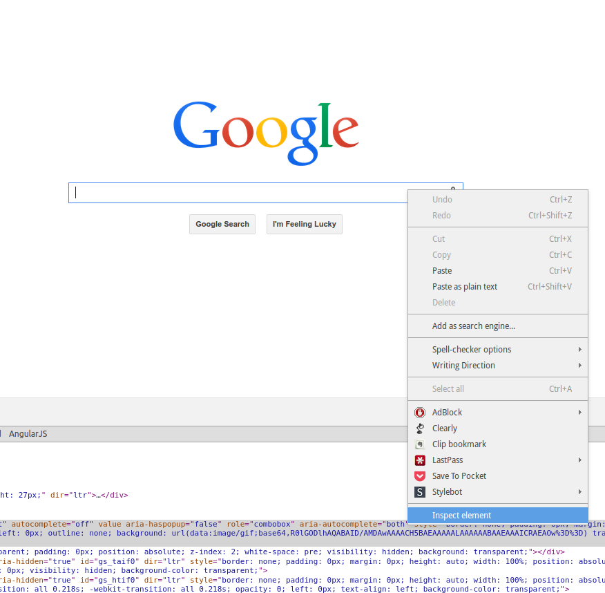
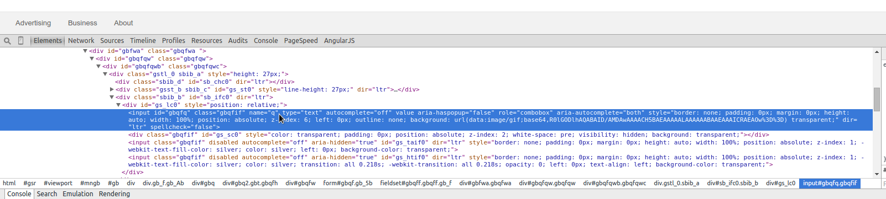

Locators
========

.. toctree::
   :maxdepth: 2

What are Locators
-----------------

Locators are the most basic element in Slick Webdriver.  The idea is that a locator defines how to find an element
that you want to take action on.  How you define your locators can help make the difference between easy and
very difficult maintenance levels for your tests.  The good news is that it's easy to make your maintenance easy.

Locators are instances of the :class:`slickwd.WebElementLocator`.  The most critical parameter to it's constructor is
often created by using methods on the :class:`slickwd.Find` class.  For an example see :doc:`examples` .

If you can keep your locators defined simply, they are less likely to break when something else in the website you are
testing changes.  It can be frustrating to have your tests break because an unrelated area of the product was changed.
To avoid this you want to define your locators using information that doesn't depend on other areas of the web page.

Creating One Step by Step
-------------------------

In the end, your are looking for something unique about the element you are trying to locate.  Most often web
developers need to identify the element uniquely for styling or attaching javascript event listeners, so you
shouldn't have too much trouble.

Step 1: Navigate to the page in a browser
~~~~~~~~~~~~~~~~~~~~~~~~~~~~~~~~~~~~~~~~~

Open a web browser and go to the page you are automating.  Which web browser you choose should be based on which one
you are most comfortable working with (as long as it is one you are testing on as well).  Most browsers have good
dev tools to help you.  Make sure you turn them on so they are available.  For this example I'll be showing Chrome's
dev tools.

The locator we are going to create in this example will be the google search page's search box.  So in this example
I navigate to `www.google.com <https://www.google.com>`_.

Step 2: Inspect the element using dev tools
~~~~~~~~~~~~~~~~~~~~~~~~~~~~~~~~~~~~~~~~~~~

Right click on the element to and select *Inspect Element* (the name may be different if you are using a different
browser).

|inspect-element-1|

You should see a line in your inspector highlighted like this:

|inspect-element-2|

Step 3: Select an attribute
~~~~~~~~~~~~~~~~~~~~~~~~~~~

Which attribute to choose???  Normally if there is an id available I would say use that.  But with forms I like
choosing the name.  This is because I believe that developers are lazy and if an id changes they only have to change
css or javascript.  If a name changes, they usually have to change the backend, and it might possibly break any links
they have.  I find the *name* attribute on forms to be more stable, especially on a search like this.

Step 4: Add it to a page class
~~~~~~~~~~~~~~~~~~~~~~~~~~~~~~

Depending on which type of page class pattern you have selected (see :doc:`page-classes` for more detail), where you
put the following line will change, as well as the assignment.  I'll show the nested page class syntax here because it's
my personal preference::

    class GoogleHomePage(Container):
        """
        Google "Home" page, or www.google.com.
        """

        def __init__(self):
            self.Search_Query_Text_Field = WebElementLocator("Search Box", Find.by_name("q"))

In this example I've added the :class:`slickwd.WebElementLocator` to a page class called *GoogleHomePage*.  The first
parameter to the :class:`slickwd.WebElementLocator` initializer is a string which is the name of the element.  This is
a plain english name explaining the purpose of the element so it's easier to read and understand in the logs.

The second parameter is a find expression using the :class:`slickwd.Find` class.  In this case I used the name property
to find the element.  It's important to note that finders work best when they uniquely identify the element.  With id or
name properties that's easy, with css class names, sometimes it's hard.

More Complex Strategies
-----------------------

If the element your trying to uniuqely identify on the page has nothing unique, you may have to rely on other
elements in the hierarchy to uniquely identify it.  This could be a pattern of how the element is laid out,
an ancestor that is uniquely identifiable, etc.  `XPath <http://www.w3schools.com/xpath>`_ is an immensely powerful
language for finding elements, and webdriver supports using it to find elements.  However, it can make code harder
to read an understand by a novice.  Also complex XPath expressions will likely make your tests more fragile.  Use
with caution.  Sometimes you have no choice.

